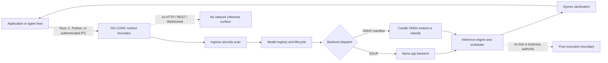

<p align="center">
  
</p>

<h1 align="center">GG-CORE</h1>

<p align="center">
  <strong>Greatest Good - Contained Offline Restricted Execution</strong><br>
  A security-first local inference runtime for applications that need model execution without granting the model network, data, tool, or system authority.
</p>

<p align="center">
  <a href="https://github.com/MythologIQ-Labs-LLC/GG-CORE/actions/workflows/rust.yml"></a>
  <a href="CHANGELOG.md"></a>
  <a href="LICENSE"></a>
  <a href="docs/FEATURE_INDEX.md"></a>
  
</p>

<p align="center">
  <a href="#start-here">Start here</a> ·
  <a href="#run-gg-core-as-a-standalone-runtime">Standalone runtime</a> ·
  <a href="#embed-gg-core-in-rust">Rust consumer</a> ·
  <a href="#other-consumer-surfaces">C, Python, and IPC</a> ·
  <a href="#security-and-trust-boundary">Security</a> ·
  <a href="#claim-and-evidence-policy">Evidence policy</a>
</p>

---

## What GG-CORE is

GG-CORE is a Rust inference kernel built around four constraints:

| Principle | Runtime promise |
| --- | --- |
| **Contained** | Execute models inside a constrained process boundary with explicit resource limits and platform sandbox controls. |
| **Offline** | Use local model files and local IPC. GG-CORE exposes no HTTP, REST, or WebSocket inference server. |
| **Restricted** | Accept authenticated requests through Unix sockets or Windows named pipes instead of granting ambient application authority. |
| **Execution** | Perform model compute only. GG-CORE does not own business logic, tools, external data, agent policy, or system actions. |

GG-CORE can run as a local IPC daemon or be consumed in-process through Rust, C FFI, or Python bindings. The secure public inference path is `Runtime::infer` / `Runtime::infer_stream`: prompt scanning happens before execution, and output sanitization happens before results leave the runtime.



## Start here

Choose the integration surface that matches the deployment and ownership boundary.

| You need | Use | Current state |
| --- | --- | --- |
| A separate local process with health, status, streaming, cancellation, and authenticated IPC | `gg-core-cli` daemon | **Operational with an already registered model.** First-class CLI preload/load/unload is tracked in [#106](https://github.com/MythologIQ-Labs-LLC/GG-CORE/issues/106). |
| A Rust application that owns model lifecycle directly | `gg_core` library | **Verified primary embedding path.** Use the secure `Runtime` façade. |
| A stable native boundary for C, C++, .NET, or other FFI consumers | `cdylib` + `include/gg_core.h` | **Implemented and covered by the `ffi` CI feature leg.** |
| Python-native local inference | PyO3 module `gg_core` | **Implemented and covered by the `python` CI feature leg.** Packaging automation is not yet a polished release surface. |
| A non-Rust process that can implement a local framed protocol | Raw IPC | **Implemented.** JSON over a 4-byte little-endian length prefix after an authenticated handshake. |

### Capability maturity

The labels below are part of the product contract:

- **Verified** means a current source path and direct test binding are recorded.
- **Conditional** means the capability is implemented but depends on a feature flag, platform primitive, local model artifact, or deployment configuration.
- **Experimental** means correctness work exists but production or performance evidence is incomplete.
- **Planned** means the expectation is retained and linked to explicit completion work.

| Capability | Maturity | Evidence and boundary |
| --- | --- | --- |
| Secure Rust inference façade | **Verified** | `Runtime::infer` and `infer_stream` are the sole external engine path; direct engine execution is crate-private. |
| GGUF text generation | **Verified + Conditional** | Real-model E2E coverage exists for Qwen 2.5 0.5B Q4_K_M. Other llama.cpp-compatible GGUF families are expected, not blanket-certified. |
| ONNX embedding and classification | **Verified + Conditional** | Enabled with `onnx`; CPU execution; selected by a sibling `manifest.json`; classification requires ordered labels. |
| Local IPC daemon | **Verified + Conditional** | Server, authentication, probes, status, inference, streaming, cancellation, metrics, and model listing exist. A model must already be registered. |
| Standalone first-run model bootstrap | **Planned** | Startup preload and CLI load/unload are owned by [#106](https://github.com/MythologIQ-Labs-LLC/GG-CORE/issues/106). |
| Adaptive speculative decoding | **Experimental** | Wired behind `advanced`, off by default, with correctness and fallback tests. Current `main` does not claim a demonstrated wall-clock speedup. |
| CUDA, Metal, and multi-GPU subsystems | **Experimental + Conditional** | Feature-gated code and test bindings exist; hardware-specific end-to-end acceptance is not equivalent to default CI coverage. |
| FIPS posture | **Conditional** | Power-on cryptographic self-tests and FIPS-oriented controls exist. GG-CORE is not represented as FIPS 140-3 certified. |
| Independent production security assurance | **Planned** | Internal threat modeling and adversarial tests exist. Independent audit and formal certification remain roadmap work. |

The full source-to-test map lives in [`docs/FEATURE_INDEX.md`](docs/FEATURE_INDEX.md). The README claim audit is recorded in [`docs/README_VERIFICATION.md`](docs/README_VERIFICATION.md).

---

## Build matrix

GG-CORE is currently built from the `core-runtime/` crate.

```bash
git clone https://github.com/MythologIQ-Labs-LLC/GG-CORE.git
cd GG-CORE/core-runtime
```

Use the stable Rust toolchain. Native prerequisites vary by selected backend.

| Build | Command | Notes |
| --- | --- | --- |
| Core runtime, no model backend | `cargo build --release` | Control plane, security, registry, scheduler, IPC, and non-backend tests. Cannot execute a model. |
| GGUF text generation | `cargo build --release --features gguf` | Builds the llama.cpp-backed path. Requires a native C/C++ toolchain, CMake, and libclang/bindgen support appropriate to the platform. |
| ONNX embed/classify | `cargo build --release --features onnx` | Uses Candle ONNX. CI installs `protoc` for this feature. |
| Both current backends | `cargo build --release --features full` | `full` currently expands to `gguf` + `onnx`. It does not include every optional language or hardware feature. |
| C ABI | `cargo build --release --features "ffi,gguf"` | Produces the `cdylib` and regenerates `include/gg_core.h`. Replace `gguf` with the backend combination you need. |
| Python | `cargo build --release --features "python,gguf"` | Builds the PyO3 surface. Python 3.8+ ABI compatibility is configured; wheel/developer packaging still needs a documented release workflow. |
| Adaptive/TierSynergy work | `cargo build --release --features "gguf,advanced"` | Experimental, off by default at runtime, and not part of the current feature-matrix CI job. |
| NVIDIA support | `cargo build --release --features "gguf,cuda"` | Requires a compatible CUDA toolkit and hardware. |
| Apple Metal support | `cargo build --release --features "gguf,metal"` | macOS only. |

The default CI workflow runs formatting, clippy, and tests on Linux, macOS, and Windows, plus dedicated `gguf`, `onnx`, `ffi`, and `python` feature legs. A model-free benchmark smoke and gross-regression gate also runs on pull requests.

### Windows GGUF build notes

A common local setup is:

```powershell
$env:LIBCLANG_PATH = "C:\Program Files\LLVM\bin"
$env:CMAKE_GENERATOR = "Visual Studio 17 2022"
cargo build --release --features gguf
```

Exact LLVM, CMake, and compiler paths depend on the host. The verified historical GGUF benchmark used LLVM 15.0.7 and Visual Studio 2022; that is evidence for one setup, not a universal version ceiling.

### ONNX local artifact layout

GG-CORE does not download models or tokenizers. For ONNX, place a sibling `manifest.json` next to the model. A local `tokenizer.json` is strongly recommended.

```text
models/
  sentiment.onnx
  manifest.json
  tokenizer.json
```

Example classification manifest:

```json
{
  "model_id": "sentiment-v1",
  "name": "Local sentiment classifier",
  "version": "1.0.0",
  "capabilities": ["text_classification"],
  "sha256": "<64-character SHA-256>",
  "size_bytes": 12345678,
  "architecture": "onnx",
  "license": "Apache-2.0",
  "labels": ["negative", "neutral", "positive"]
}
```

An ONNX manifest must declare exactly one currently servable capability: `text_classification` or `embedding`. Classification also requires non-empty ordered `labels`. Unsupported or ambiguous manifests fail loud.

---

## Run GG-CORE as a standalone runtime

The standalone binary is `gg-core-cli` (`gg-core-cli.exe` on Windows). With no command, it defaults to `serve`.

### 1. Build the daemon

```bash
cd core-runtime
cargo build --release --features gguf
```

### 2. Configure the local boundary

Linux or macOS:

```bash
export CORE_AUTH_TOKEN='replace-with-a-long-random-local-secret'
export GG_CORE_SOCKET_PATH='/tmp/gg-core.sock'
export RUST_LOG='gg_core=info'
```

Windows PowerShell:

```powershell
$env:CORE_AUTH_TOKEN = "replace-with-a-long-random-local-secret"
$env:RUST_LOG = "gg_core=info"
# Default transport: \\.\pipe\GG-CORE
```

The most important runtime settings are:

| Variable | Default | Purpose |
| --- | ---: | --- |
| `CORE_AUTH_TOKEN` | empty | Shared token used for local IPC session authentication. Set it for real deployments. |
| `GG_CORE_SOCKET_PATH` | platform default | Unix socket path or Windows named-pipe path. |
| `GG_CORE_MAX_CONTEXT` | `4096` | Runtime context limit. |
| `GG_CORE_MAX_QUEUE_DEPTH` | `256` | Maximum pending requests. |
| `GG_CORE_MAX_CONCURRENT` | `2` | Concurrent request resource gate. |
| `GG_CORE_MAX_TOTAL_MEMORY` | `2147483648` | Total governed runtime memory in bytes. |
| `GG_CORE_IPC_FRAME_LIMIT` | `16777216` | Maximum framed IPC message size. |
| `GG_CORE_MAX_CONNECTIONS` | `64` | Concurrent IPC connection limit. |
| `GG_CORE_SHUTDOWN_TIMEOUT` | `30` | Graceful drain timeout in seconds. |

Use `gg-core-cli config defaults`, `config show`, and `config validate` to inspect the effective configuration surface.

### 3. Start the process

Linux or macOS:

```bash
./target/release/gg-core-cli serve
```

Windows PowerShell:

```powershell
.\target\release\gg-core-cli.exe serve
```

Startup runs cryptographic power-on self-tests before opening the IPC server. `Ctrl+C` initiates graceful request draining.

### 4. Verify the daemon from another terminal

```bash
gg-core-cli live
gg-core-cli ready
gg-core-cli health
gg-core-cli status --json
gg-core-cli models list
```

Expected meanings:

- `live`: the process responds.
- `ready`: the runtime reports that it can serve work.
- `health`: full health state.
- `status --json`: machine-readable runtime diagnostics.
- `models list`: registered model inventory.

### 5. Run inference after a model is registered

```bash
gg-core-cli infer \
  --model qwen2.5-0.5b-instruct-q4_k_m \
  --prompt "Explain why an offline inference boundary matters." \
  --max-tokens 128
```

Streaming:

```bash
gg-core-cli infer \
  --model qwen2.5-0.5b-instruct-q4_k_m \
  --prompt "Give me three concise design principles." \
  --max-tokens 128 \
  --stream
```

### Current standalone limitation

The daemon currently starts with an empty model registry, and the IPC/CLI model lifecycle exposes `models list` but not `models load` or `models unload`. Therefore the process, probes, protocol, and inference command are real, but a completely independent first-run inference journey still needs startup preload and authenticated model lifecycle commands.

That expectation is preserved and fully specified in [issue #106](https://github.com/MythologIQ-Labs-LLC/GG-CORE/issues/106). Until it lands, use the embedded Rust, C FFI, or Python surface to load models, or use a host that registers a model before IPC inference.

---

## Embed GG-CORE in Rust

### 1. Add the dependency

GG-CORE is currently consumed most predictably as a vendored checkout or git submodule:

```toml
[dependencies]
gg-core = {
  path = "../GG-CORE/core-runtime",
  default-features = false,
  features = ["gguf"]
}
tokio = { version = "1", features = ["macros", "rt-multi-thread"] }
```

Use `features = ["onnx"]` for ONNX only, or `features = ["gguf", "onnx"]` for both.

### 2. Create the runtime, load a local model, and infer

```rust
use gg_core::engine::InferenceParams;
use gg_core::models::load_model_dispatch;
use gg_core::{Runtime, RuntimeConfig};
use std::path::PathBuf;

#[tokio::main]
async fn main() -> Result<(), Box<dyn std::error::Error>> {
    let runtime = Runtime::new(RuntimeConfig {
        base_path: PathBuf::from("./models"),
        auth_token: "local-application-secret".to_owned(),
        max_context_length: 4096,
        ..Default::default()
    });

    // Paths are validated relative to RuntimeConfig.base_path.
    let path = runtime
        .model_loader
        .validate_path("qwen2.5-0.5b-instruct-q4_k_m.gguf")?;
    let metadata = runtime.model_loader.load_metadata(&path)?;
    let model_id = metadata.name.clone();

    // Optional sibling manifest.json selects ONNX; otherwise GGUF is the default.
    let model = load_model_dispatch(path.as_path(), &model_id)?;
    runtime
        .model_lifecycle
        .load(model_id.clone(), metadata, model)
        .await?;

    let params = InferenceParams {
        max_tokens: 128,
        temperature: 0.7,
        top_p: 0.9,
        top_k: 40,
        ..Default::default()
    };

    // Always use the Runtime façade. It enforces ingress scanning and egress sanitization.
    let result = runtime
        .infer(
            &model_id,
            "Explain the C.O.R.E. boundary in one paragraph.",
            &params,
        )
        .await?;

    println!("{}", result.output);
    Ok(())
}
```

### Consumer invariants

1. Use `Runtime::infer` or `Runtime::infer_stream`, not internal engine paths.
2. Keep model files inside the configured `base_path` and load through `ModelLoader` + `ModelLifecycle`.
3. Enable only the features the host needs.
4. Treat model licensing, provenance, and compatibility as host responsibilities.
5. Do not add network download behavior inside the GG-CORE runtime boundary.
6. Preserve fail-loud behavior when a backend, manifest, tokenizer, or model is unsupported.

---

## Other consumer surfaces

### C and C++ FFI

Build:

```bash
cd core-runtime
cargo build --release --features "ffi,gguf"
```

Artifacts:

- Header: [`core-runtime/include/gg_core.h`](core-runtime/include/gg_core.h)
- Windows library: `target/release/gg_core.dll`
- Linux library: `target/release/libgg_core.so`
- macOS library: `target/release/libgg_core.dylib`

Canonical call order:

```text
core_config_default
  -> set base_path and auth_token
  -> core_runtime_create
  -> core_model_load
  -> core_authenticate
  -> core_infer or core_infer_streaming
  -> core_free_result / core_free_string as required
  -> core_session_release
  -> core_runtime_destroy
```

The C surface returns typed `CoreErrorCode` values, including `SecurityRejected`, and exposes health, metrics, model lifecycle, bounded-buffer inference, timeout, and callback streaming APIs.

### Python

The PyO3 module is named `gg_core` and exposes `Runtime`, `Session`, `AsyncSession`, `InferenceParams`, and result/model types.

Build the extension surface:

```bash
cd core-runtime
cargo build --release --features "python,gguf"
```

A typical consumer flow is:

```python
import gg_core

runtime = gg_core.Runtime(
    auth_token="local-application-secret",
    base_path="./models",
)

with runtime.session() as session:
    session.load_model("qwen2.5-0.5b-instruct-q4_k_m.gguf")
    result = session.infer(
        "qwen2.5-0.5b-instruct-q4_k_m",
        "Explain local inference containment.",
    )
    print(result.output)
```

The binding code and CI feature leg exist. A reproducible wheel/developer-install workflow is still documentation and release-engineering work, so do not treat the raw Cargo build command as a published Python package promise.

### Raw IPC

Use raw IPC when a non-Rust host wants process isolation without the C or Python binding.

Transport contract:

| Property | Value |
| --- | --- |
| Windows | Named pipe, default `\\.\pipe\GG-CORE` |
| Unix | Unix socket, default `/var/run/gg-core/GG-CORE.sock` |
| Framing | 4-byte little-endian payload length followed by UTF-8 JSON |
| Authentication | First message is a token handshake; the server returns a session ID and negotiated protocol version |
| Inference | Non-streaming response or typed streaming chunks with clean/error terminal distinction |
| Network | No HTTP, REST, WebSocket, or TCP inference endpoint |

See [`docs/IPC_PROTOCOL_SCHEMA.md`](docs/IPC_PROTOCOL_SCHEMA.md) and the current wire types in [`core-runtime/src/ipc/protocol_types.rs`](core-runtime/src/ipc/protocol_types.rs). When those disagree, the code and protocol tests win.

---

## Security and trust boundary

GG-CORE's security value is not that local inference becomes magically harmless. It is that the execution surface is narrower, inspectable, and harder to accidentally grant authority.

### Enforced in the runtime path

- Authenticated local IPC sessions.
- Prompt-injection risk scanning before inference.
- PII-oriented output sanitization after inference.
- Streaming text sanitization before emitted text leaves the runtime.
- Model-path validation under the configured base path.
- Request, queue, connection, context, and memory limits.
- Graceful shutdown and request draining.
- Structured audit and telemetry surfaces.
- Platform-specific sandbox implementations and fail-loud paths.
- AES-256-GCM model-encryption components with key zeroing and nonce-reuse defenses.

### Deployment responsibilities that remain yours

- Run the process under a restricted OS identity.
- Apply deny-all network policy at the OS, container, VM, or host firewall layer.
- Provision a strong local authentication token.
- Restrict filesystem permissions around model, tokenizer, cache, and temporary directories.
- Verify model provenance, license, integrity, and expected architecture.
- Validate the selected sandbox path on the actual operating system and GPU driver stack.
- Treat generated output as untrusted application input even after runtime sanitization.
- Perform independent security review before production or regulated deployment.

### Important assurance language

- Rust reduces broad classes of memory-safety defects, but GG-CORE still contains isolated `unsafe` code at FFI, native backend, cryptographic, and platform-sandbox boundaries.
- Cryptographic power-on self-tests are not the same thing as FIPS 140-3 certification.
- Internal threat models, tests, and governance evidence are not substitutes for an independent penetration test or formal compliance assessment.
- "Offline" means GG-CORE exposes local execution and IPC rather than a network inference service. Strong air-gap assurance still requires host-level enforcement and deployment verification.

Read the current [threat model](docs/security/THREAT_MODEL.md), [unsafe-code audit](docs/security/UNSAFE_AUDIT.md), and [security policy](SECURITY.md). Known drift in the older security, roadmap, and usage documents is tracked in [#107](https://github.com/MythologIQ-Labs-LLC/GG-CORE/issues/107).

---

## Performance

GG-CORE uses llama.cpp through `llama-cpp-2` for GGUF execution, so model throughput is primarily determined by the model, quantization, context, backend, compiler flags, and hardware. GG-CORE's differentiated work is the contained runtime boundary, secure façade, lifecycle, scheduling, IPC, observability, and governed fallback behavior around that backend.

### Reproduced baseline

The repository records one real-model release baseline:

| Model | Build | Hardware | Result |
| --- | --- | --- | ---: |
| Qwen 2.5 0.5B Instruct, GGUF Q4_K_M | Release, thin LTO | Intel i7-7700K, Windows 10 | approximately **40 tokens/sec** |

That result is useful evidence for that exact configuration. It is not a promise for other models or machines.

### Benchmark discipline

- CI runs model-free benchmark smoke tests and a same-runner gross-regression gate.
- Absolute hardware results must include commit, model, quantization, prompt profile, compiler/build flags, and hardware.
- Estimated matrices remain labeled estimates.
- Control-path benchmarks are not presented as proof that model kernels outperform Ollama, llama.cpp, or vLLM.
- Adaptive speculative decoding currently carries a correctness claim, not a general speedup claim.

See [`docs/BENCHMARKS.md`](docs/BENCHMARKS.md) for the recorded baseline and benchmark methodology. Some older comparative tables are under reconciliation in [#107](https://github.com/MythologIQ-Labs-LLC/GG-CORE/issues/107).

---

## Architecture and repository map

```text
GG-CORE/
├── core-runtime/               Rust crate, CLI, FFI, Python, tests, benches
│   ├── src/
│   │   ├── engine/             Model trait, GGUF, ONNX, streaming, advanced inference
│   │   ├── security/           Ingress, egress, encryption, audit, FIPS-oriented tests
│   │   ├── ipc/                Authenticated framed protocol and server
│   │   ├── models/             Loader, registry, lifecycle, dispatch, preload, routing
│   │   ├── scheduler/          Queue, batching, worker, cancellation, cache
│   │   ├── memory/             Pools, limits, KV and prompt cache
│   │   ├── sandbox/            Platform-specific containment primitives
│   │   ├── telemetry/          Metrics and spans
│   │   ├── ffi/                C ABI
│   │   └── python/             PyO3 bindings
│   ├── tests/                  Integration, security, protocol, chaos, backend tests
│   ├── benches/                Criterion benchmark surfaces
│   └── include/gg_core.h       Generated C header
├── docs/architecture/          Living architecture and ADRs
├── docs/security/              Threat model and security analysis
├── docs/FEATURE_INDEX.md       Feature-to-source-to-test evidence map
├── docs/META_LEDGER.md         Governed change and substantiation ledger
└── .github/workflows/          Cross-platform CI and feature matrix
```

The living code-grounded architecture overview is [`docs/architecture/CORE_RUNTIME_ARCHITECTURE.md`](docs/architecture/CORE_RUNTIME_ARCHITECTURE.md).

---

## Claim and evidence policy

GG-CORE does not treat documentation polish as permission to blur maturity.

Every material README claim should resolve to one of these outcomes:

1. **Verified now**: link the code, test, CI, benchmark, or release evidence.
2. **Conditional now**: name the required feature, model, platform, or deployment control.
3. **Experimental now**: preserve the capability and state what remains unproven.
4. **Planned**: retain the expectation and link owned implementation work.
5. **Rejected**: remove only when code, architecture, and product intent show that the claim is no longer desired.

The evidence record for this README is [`docs/README_VERIFICATION.md`](docs/README_VERIFICATION.md). It documents which older claims were retained, narrowed, reclassified, or linked to completion work.

---

## Documentation

| Document | Purpose | Authority |
| --- | --- | --- |
| [Runtime architecture](docs/architecture/CORE_RUNTIME_ARCHITECTURE.md) | Code-grounded system and trust-boundary overview | Current living architecture |
| [Feature index](docs/FEATURE_INDEX.md) | Feature, source, design citation, and direct test binding | Current evidence inventory |
| [Changelog](CHANGELOG.md) | Release and unreleased change chronology | Release history |
| [IPC schema](docs/IPC_PROTOCOL_SCHEMA.md) | Framing and message examples | Useful guide; code types win on drift |
| [Threat model](docs/security/THREAT_MODEL.md) | Attack surfaces, trust boundaries, and mitigations | Security design |
| [Benchmarks](docs/BENCHMARKS.md) | Reproducible baseline and benchmark notes | Measurement record with stated limits |
| [README verification](docs/README_VERIFICATION.md) | Claim audit, sources, and maturity decisions | README substantiation record |
| [Backlog](docs/BACKLOG.md) | Owned engineering gaps and follow-on work | Work inventory |
| [Security policy](SECURITY.md) | Vulnerability reporting and support policy | Public policy; reconciliation tracked in #107 |

---

## Development and verification

From `core-runtime/`:

```bash
# Formatting
cargo fmt --check

# Default surface
cargo clippy --all-targets -- -D warnings
cargo test --workspace

# Backend and consumer surfaces
cargo clippy --features gguf --all-targets -- -D warnings
cargo test --features gguf

cargo clippy --features onnx --all-targets -- -D warnings
cargo test --features onnx

cargo clippy --features ffi --all-targets -- -D warnings
cargo test --features ffi

cargo clippy --features python --all-targets -- -D warnings
cargo test --features python

# Advanced surface, currently outside the standard CI feature matrix
cargo clippy --features "gguf,advanced" --all-targets -- -D warnings
cargo test --features "gguf,advanced"
```

Real-model GGUF tests require a local model fixture and are intentionally not satisfied by mock fallback behavior.

---

## Contributing

GG-CORE is Apache 2.0 licensed. Contributions should preserve the C.O.R.E. boundary, fail-loud behavior, secure façade, feature evidence, and documentation maturity labels.

Before submitting a pull request:

1. Read the [Contributor License Agreement](CLA.md).
2. Ground the change in an issue, ADR, plan, or clearly stated defect.
3. Add or update a direct test binding.
4. Run the relevant feature-specific commands above.
5. Update the feature index, changelog, architecture, threat model, or README when the public contract changes.
6. State what was verified, what remains conditional, and what is deliberately out of scope.

Security vulnerabilities should follow [SECURITY.md](SECURITY.md), not a public issue. The security-policy reconciliation work is tracked in [#107](https://github.com/MythologIQ-Labs-LLC/GG-CORE/issues/107), so verify the available private reporting channel before disclosing sensitive details.

---

## License

Licensed under the [Apache License 2.0](LICENSE).

Copyright 2024-2026 GG-CORE Contributors.
